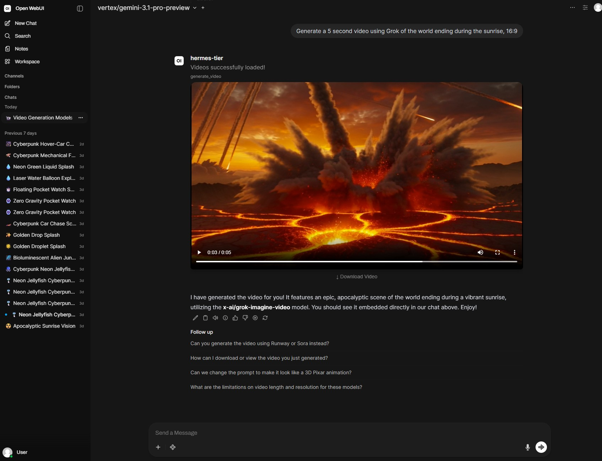

# OpenRouter Video Generator Tool for OpenWebUI

A fully autonomous, "agentic" video generation tool for OpenWebUI powered by OpenRouter. This tool empowers your LLM assistant to dynamically discover available video models, submit generation jobs, securely poll for completion, and directly embed the resulting HD videos inside your OpenWebUI chat stream.

## 🚀 Features

- **Agentic Model Discovery:** The LLM can dynamically pull the live catalog of OpenRouter's video models (Sora, Veo, Kling, Minimax, Luma, etc.) and check their capabilities (supported resolutions, aspect ratios, max durations) in real time.
- **Background Polling & Auto-Download:** Handles OpenRouter's asynchronous polling endpoints autonomously. Downloads completed `.mp4` assets to your local OpenWebUI static server to prevent broken links or expired signed URLs.
- **Rich HTML5 Embedding:** Injects a beautiful, responsive HTML5 video player natively inside the chat interface with a direct download link.
- **Advanced Model Features:** Supports audio generation toggling, image references for style consistency, and provider-specific passthrough options (e.g. `negativePrompt` for Google Vertex).

## 📦 Installation

1. Open your OpenWebUI instance.
2. Navigate to **Workspace** -> **Tools**.
3. Click **+ Add Tool**.
4. Give it a name (e.g., `OpenRouter Video`).
5. Copy the entire contents of [`openrouter_video_tool.py`](./openrouter_video_tool.py) and paste it into the code editor.
6. Click **Save**.

## ⚙️ Configuration

Once installed, you must provide your OpenRouter API key:
1. Go to the tool's settings (the small equalizer icon next to the tool name, or inside the tool configuration page under Valves).
2. Set your `OPENROUTER_API_KEY`. Get one at [openrouter.ai/keys](https://openrouter.ai/keys).
3. Ensure the tool is **Enabled** in your chat window.

## 🗣️ Usage Examples

Because this tool is entirely LLM-driven, you don't need to fiddle with drop-down menus before generating. Just ask your assistant naturally!

**Ask about available models:**
> "What video models can I use right now, and which ones support audio?"

**Generate a video with specific constraints:**
> "Use Grok to generate a 5-second video of a fluffy ginger cat watching the rain. Aspect ratio 16:9."

**Provide styling references:**
> "Make a cinematic panning shot of a cyberpunk city. I've attached an image to use as a style reference, but don't use it as the exact first frame."

## 🛠️ Requirements
- `aiohttp` (Automatically parsed by OpenWebUI)
- An active OpenWebUI instance.

## 📜 License
MIT License. Feel free to fork and modify!
